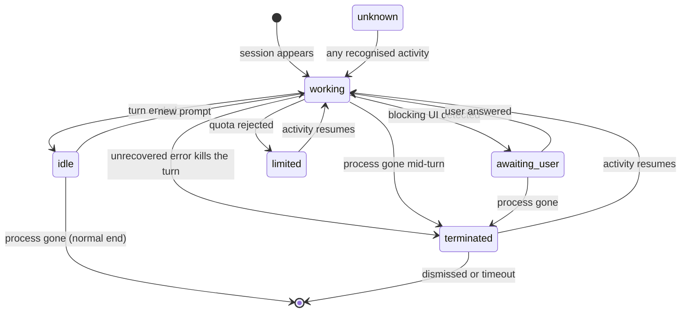

# Session state model

The single most important specification in this repository: what the colours on the board
mean, and exactly when a session changes from one to another.

Read [observation-sources.md](observation-sources.md) first for where the raw signals come
from, and [requirements.md](requirements.md) for the requirement IDs referenced here.

---

## 1. The statuses

The board answers three questions: **not needed** (working), **needed now**
(awaiting_user), **maybe needed** (idle) — plus two exceptional cases and an internal
fallback.

Colours are **settled** — decision D-2 is closed. They are derived from a luminance ladder
and validated numerically ([ADR-0010](adr/0010-derive-the-palette-from-a-luminance-ladder.md));
the exact hexes for both themes, and the separation each pair is required to keep, live in
[ui-overlay.md](ui-overlay.md) §3. The *semantics*, *precedence*, and *transitions* below are
the part that was always meant to be stable, and none of them changed.

| Id | Meaning to the user | Colour (dark theme) | Silhouette | Motion | Glyph |
|---|---|---|---|---|---|
| `working` | Claude is doing something. Leave it alone. | teal `#08C5BD` | filled disc | none — bright and still | `▶` |
| `awaiting_user` | Claude put a blocking UI in front of you and cannot continue. **Go here.** | amber `#FDC405` | filled disc **+ a wave** | the wave travels out past the board's edge (~1.4 s) | `?` |
| `idle` | Stopped. Whether it finished the job is not something this tool claims to know ([ADR-0005](adr/0005-no-goal-achievement-status.md)). | grey `#676B6F` — **the faintest of the five** | filled disc | none | `▪` |
| `terminated` | The work stopped in a way nobody asked for — an error killed the turn, or the process died mid-work (§7). | crimson `#EE0131` | filled disc | blink (~1.2 s), then static | `✕` |
| `limited` | Blocked by the usage limit. Nothing to do but wait. | violet `#B759F7` | filled disc | none — the row shows the reset time as text | `⏳` |
| `unknown` | Live, but the observer cannot tell. | grey `#85898E` | **dotted ring** — the one shape that is not a disc | none | `–` |
| *(absent)* | Not running. **Not drawn at all** — no placeholder, no empty slot. | — | — | — | — |

Design notes:

- **Colour carries the status, and it is measured doing it** (FR-17, amended 2026-08-27):
  every pair keeps the separation `ui-overlay.md` §3.3 states for it under greyscale and
  under three simulated colour-vision deficiencies, checked on every run by TC-49 … TC-51.
  Each status used to have a silhouette of its own as well; six shapes were six things to
  learn on a board that is glanced at, and they were insurance on a number already checked
  ([ADR-0024](adr/0024-colour-carries-the-status-shape-carries-the-hierarchy.md)). The shape
  now says whether a mark is a workspace or a session inside one.
- The **glyph is not drawn on the board.** It appears in the tooltip. The reason was size —
  the indicator was 10 px, where a glyph would have been about 6 px tall — and the indicator
  is 15 px now, so the reason has weakened without anyone measuring the replacement. It stays
  in the tooltip until someone does (ui-overlay.md §2). The accessibility claim rests on
  silhouette and motion either way.
- **`idle` is the faintest thing the board draws**, because it is the least urgent of the
  five — a finished session should not compete with one that needs the developer
  ([ADR-0013](adr/0013-make-idle-the-faintest-thing-on-the-board.md)). On the dark theme it
  sits at the 3:1 contrast floor, which is as recessive as an indicator is allowed to be.
- `working` moved off the provisional lime for a measured reason: against amber it scored
  dE2000 **6.2** under simulated deuteranopia — the two statuses meaning *leave it alone* and
  *go here*, nearly indistinguishable for the commonest colour-vision deficiency.
- **Motion is rationed.** Only `awaiting_user` and `terminated` animate for attention,
  because only they mean "the developer has to move". A board where everything moves teaches
  the user to ignore it.
- **`working` does not move at all** ([ADR-0021](adr/0021-working-does-not-animate.md)). It
  pulsed until the board had been watched for a day: `working` is what the board shows most
  of the time, so the pulse was not a signal but the board's resting appearance — perpetual
  movement in the corner of the eye. Brightness says *this is alive*; nothing needs to move
  to say it.
- There is deliberately **no "finished successfully" status**. See §5.

## 2. Transitions



## 3. Signals

Two modes. **Inference mode** works with zero configuration and is the baseline everything
must work under. **Hook mode** is the opt-in accuracy layer, installed by the product itself
through the guided setup in [hook-setup.md](hook-setup.md)
([ADR-0001](adr/0001-observe-local-state-files.md),
[ADR-0003](adr/0003-guided-hook-setup.md)). Where a hook signal exists it *overrides* the
inferred one; where hook events stop arriving, the session falls back to inference on its
own (FR-52).

| Transition | Inference mode (default) | Hook mode (opt-in) |
|---|---|---|
| → `working` | Any new activity record in the transcript: a prompt, assistant output, a tool result, a queue-enqueue, a compaction boundary, or subagent activity (§4.2). | The prompt-submitted event. |
| → `awaiting_user` | A pending tool call matching the rules in §4.1. | The notification event that fires when Claude needs permission or input. |
| → `idle` | An assistant record whose stop reason ends the turn, with no pending tool call. | The turn-stop event. |
| → `limited` | A quota record with `status: "rejected"` (§6). | Same — the transcript stays the source; hooks add nothing here. |
| → `terminated` | Either an unrecovered error ends the turn with the session still running, or the process dies while the state was `working` / `awaiting_user` and **leaves its registry entry behind** (§7.2). | Same for the error case; for the process case, the session ended with no clean session-end event. |
| → *(absent)* | The process dies from `idle`, or it dies taking its registry entry with it, or the owning editor exited too (§7.2). | The clean session-end event. |
| → `unknown` | The transcript cannot be parsed, or its version is not understood (FR-39). | — |

The fallback in the last sentence needs nothing to drive it: each session holds when a hook
last reported anything about it, and once that is older than `T_hook_quiet` the rules below
apply again on their own
([ADR-0020](adr/0020-hook-signals-are-facts-not-status-writes.md)).

**The end of a turn is structural, not a timeout.** Assistant records carry a stop reason,
so "the turn is over" is read directly rather than inferred from silence. The idle timer
below exists only as a fallback for turns that end without one.

Hook mode changes *how fast and how certainly* a transition is known, never *what the
statuses mean*. No hook is installed on any event that could interfere with a session
(FR-47).

### Timers

| Name | Default | Why |
|---|---|---|
| `T_idle_fallback` | 3 s | Only used when a turn stops without a readable stop reason. The normal path does not wait. **A `null` stop reason does not trigger it** — that is a mid-stream partial record, not a stopped turn (see [observation-sources.md](observation-sources.md) §2.3). This timer is for a transcript that simply goes quiet. |
| `T_pending_interactive` | 1.5 s | Debounce before calling an *always-interactive* tool call a wait (§4.1). |
| `T_pending_probe` | **10 s** | How long a pending call is given to show a running process before its absence counts as evidence (§4.1 rule 3). It covers two real lags, not one: a tool that has already finished but whose result is not yet written, **and the startup lag before the tool's process appears at all — measured at 2.3 s on a `Bash` call** (`tool_use` written, then 2.3 s of nothing, then `bash.exe`). The first draft of this table said 2 s, which is *shorter than the measured startup lag* and would have reported a normally-starting tool as blocked. 10 s is a deliberately generous margin over a single observation; it is the least-evidenced number in this document and phase 4 must measure the lag distribution properly before trusting it. |
| ~~`T_pending_ambiguous`~~ | — | **Retired.** It produced an `awaiting_user` on elapsed time alone, at a measured 14 % precision ([ADR-0008](adr/0008-detect-blocking-by-whether-the-tool-started.md)). Nothing now turns a pending call amber without positive evidence. |
| `T_hook_quiet` | 30 min | How long the hook layer may stay silent before a session stops believing it and goes back to inference (FR-52). Generous on purpose, because silence is ambiguous: a session can sit untouched for an hour with nothing wrong. What this catches is the helper being deleted, moved or blocked — a silence that never ends. Noticing late costs nothing, since inference is what would have run anyway; a false alarm costs the board its credibility about its own accuracy. The board's mode indicator (FR-55) reads the same number, so a board still saying *exact* while its sessions had already fallen back is not a state that can occur. |
| `T_terminated_visible` | 10 min | How long a *vanished* session stays on the board before it clears itself (FR-59). An abnormal stop whose session is still running has no timer — new activity clears it. |
| ~~`T_dim`~~ | — | **Retired.** It dimmed an idle indicator after 30 minutes so that old news did not compete with new. Every row now shows its age as text, and `idle` sits at the contrast floor with no room to fade ([ADR-0013](adr/0013-make-idle-the-faintest-thing-on-the-board.md)). |

All are configurable; the defaults are the specification.

## 4. Two cases that need spelling out

### 4.1 Detecting "waiting for the user" without hooks

This is the hardest inference in the product, and the specification is deliberately
conservative.

The observable fact is a **pending tool call**: the assistant emitted a tool-use block and
no corresponding result has appeared. Tool-use records are written to the transcript
*before* the tool runs, so this is observable within a second — but the fact itself is
ambiguous. It is equally consistent with

- a permission prompt sitting on screen waiting for the user, and
- a perfectly healthy tool that simply takes a minute to run.

**Nothing in the transcript distinguishes them** — a blocking prompt writes no record at
all, measured across an `AskUserQuestion` that sat on screen for 38 minutes and produced
zero lines. But the transcript is not the only thing that can be observed: a tool that is
genuinely running has a **process**, and a tool waiting for permission has not started
([observation-sources.md](observation-sources.md) §2.4). Rules, in order:

1. **Permission cannot be pending at all** when the session's permission mode never prompts
   (bypass-style modes; mode changes are recorded and tracked live). In that case a pending
   tool call is always `working`.

   Note also that **a command being absent from the user's allow-list does not mean it will
   prompt.** Claude Code auto-approves a class of commands it judges read-only: `whoami`,
   `ping` and `reg query` were all run in `normal` mode, none of them present in a 993-entry
   allow-list, and none produced a prompt. So prompts are rarer than "unlisted tool call"
   would suggest, and the rules below must not treat every pending call as a prompt
   candidate.
2. **Always-interactive tools** — the ones whose entire purpose is to ask the user
   something (a question prompt, a plan approval) — resolve to `awaiting_user` after
   `T_pending_interactive`, with **high** confidence.
3. **Any other pending tool call** is `working`, and stays `working` **indefinitely**
   unless there is positive evidence that the tool is not running
   ([ADR-0008](adr/0008-detect-blocking-by-whether-the-tool-started.md)). Elapsed time
   alone never produces a wait. Two pieces of evidence qualify, either one sufficient:

   - **The tool has no process.** Tools that execute as a subprocess are visible as a child
     of the Claude Code process for exactly as long as they run. A call that the transcript
     says is pending, with nothing running for it, has not started — and the reason a tool
     does not start is that something is blocking it. Confidence: **high**.
   - **The call is a gross outlier for its own tool.** For a tool that never spawns a
     process, "pending far longer than this tool has ever taken" is meaningful where a
     fixed threshold is not. Measured: the `Edit` calls that exceeded 45 s ran 48× to 3,239×
     that tool's own median, while `Bash` and `PowerShell` are legitimately slow at the same
     durations. Confidence: **high**.

   **Exception:** a pending call whose subagent file is still being appended to is a running
   subagent, not a wait — it stays `working` (§4.2,
   [ADR-0007](adr/0007-detect-subagents-from-their-own-file.md)).

   When the platform cannot answer whether the tool is running, that is *no evidence*, not
   evidence of blocking: the session stays `working`.
4. When a hook signal is available, rules 2–3 are skipped entirely; the hook decides. What
   a hook reports is held as a *fact about the session* and the status is derived from it
   here, rather than the hook writing the status where it arrives: a hook line and a
   transcript line read in the same poll have no order the observer can defend, and the
   answer must not depend on which was folded in first
   ([ADR-0020](adr/0020-hook-signals-are-facts-not-status-writes.md)).

**However the user answers, the wait ends by itself.** Approving starts the tool, which is
visible; refusing writes a `tool_result` carrying an error, which ends the pending call.
Both were measured. So `awaiting_user` never needs a timeout to escape from and never
strands a session whose prompt the user has already dismissed — the same fact that put the
session into the status takes it out again.

> **Where the hook layer fits.** Hooks report this transition authoritatively and instantly,
> where the rules above infer it from two indirect signals. They remain worth having — but
> they are an accuracy upgrade, not the price of entry
> ([ADR-0008](adr/0008-detect-blocking-by-whether-the-tool-started.md) covers subprocess
> tools, in-process tools, always-interactive tools and subagents without them).
>
> Two honest caveats on the frequency of this transition. It is **rarer than the docs used
> to imply**: across 78 transcripts there were roughly 16 detectable waits against 503 turn
> ends, so `idle` is the signal the board will spend most of its time showing, and `idle`
> is free — it is read structurally from a stop reason and needs no hooks at all. But
> frequency is not value: the *cost of missing one* is far higher here than for `idle`, and
> the count is a floor rather than a total, because a prompt answered within seconds leaves
> no trace to count. The product must say when hooks are off — once, discreetly, not as a
> nag — and must be able to do the setup itself, because most users have never configured a
> hook and should not have to start now ([hook-setup.md](hook-setup.md)).

### 4.2 Compaction and subagents are activity

Two things that look like anomalies but are simply the session working:

- **Compaction.** A long session compacts its context and records a boundary. That is work,
  not a pause: it keeps the session `working`, and the records that follow it are read
  normally.
- **Subagents.** The parent session stays `working` for as long as its subagent is active,
  and subagents are never shown as sessions of their own — the board tracks what the user
  opened, not what Claude spawned.

  Note that the parent's transcript does **not** record the subagent: the side chain is
  written to a separate `agent-<hex>.jsonl` file with its own `sessionId`
  ([observation-sources.md](observation-sources.md) §2.3). The "never shown as its own
  session" half therefore comes for free — those files have no registry entry.

  The "parent stays `working`" half does not. From the parent's side a running subagent is
  an ordinary pending tool call, and a long one — measured: 6 of 15 real dispatches ran
  over 45 s, p90 354 s — so rule 3 of §4.1 would call it `awaiting_user`. **The subagent's
  own file is what resolves this: while an `agent-*.jsonl` is being appended to, the
  parent's pending call is exempt from rule 3 and the session stays `working`**
  ([ADR-0007](adr/0007-detect-subagents-from-their-own-file.md)). If no such file is
  growing, the pending call is ordinary and rule 3 applies as written.

## 5. Why there is no "finished successfully" status

Originally the model had two stopped statuses: *finished and apparently done* versus
*finished but apparently unresolved*. It was dropped after measuring the data — the
signals needed to tell them apart barely occur, and separating them properly would take a
model reading the conversation. Full reasoning, alternatives, and the conditions for
revisiting: [ADR-0005](adr/0005-no-goal-achievement-status.md).

What this means in practice:

- `idle` claims only *"this session is stopped"*. It never claims the work was finished, and
  no UI wording may suggest otherwise.
- Time-in-status is shown on the row, because "stopped 2 minutes ago" and "stopped 3 hours
  ago" are genuinely different situations — but that is a detail, not a status.
- The product does not ask the user to classify it by hand either. A status board that
  needs maintaining is not a status board.

## 6. Usage limit

- **A usage limit is not an API error.** It is a quota record — `status: "rejected"` —
  riding on the assistant record that would have carried the reply, with no `api_error`
  anywhere near it ([observation-sources.md](observation-sources.md) §2.3.1). Detection is
  structural: no wording is matched, and the message text is never read.
- The record states the reset time exactly, so the countdown the board shows (FR-15) is read
  from the data rather than computed. Measured gaps between the rejection and its reset ran
  from 5 minutes to 3 h 35, so any fixed assumption about the wait would be wrong.
- **The reset time is coarse.** Every observed value landed on a whole ten-minute mark, and
  two rejections 19 seconds apart returned the same one, so the board must not render
  seconds it does not have.
- **The countdown is not the core's to compute.** The reset *instant* is data and belongs to
  the core; the *remaining time* needs the current clock, which NFR-11 keeps out of the
  core, so it is computed in the layer that displays it.
- **The core emits both ends of the wait, not just the reset.** `limited` carries the
  reset instant *and* the instant of the first rejection that named it. A display showing
  how much of the wait is left needs the full length, and only the core can supply it: the
  rejection's timestamp is in the transcript record, which the UI never reads. Emitting one
  without the other is a core change waiting to happen — the same rejection repeated while
  still limited keeps the original start, so the pair is stable for the whole wait.
- **The status cannot arrive early.** Nothing is written before the rejection — no warning
  record, no threshold, no approaching-limit notice — so `limited` begins when the session
  is already stopped. A board that promised advance notice would be promising something the
  data cannot support.
- Only a `five_hour` window has ever been observed. A limit of another shape still presents
  as a rejection with a reset time, which yields the same status — the label on the window
  is the part that would be unknown, not the status.
- The status clears itself as soon as the session produces activity again; the board never
  requires the user to acknowledge it.

## 7. Abnormal stops

`terminated` means **the work stopped in a way nobody asked for**. That covers two
different situations, and the common one is not the dramatic one:

### 7.1 The turn died, but the session is still there

An API error exhausted its retries, or something in the session broke, and the turn ended
without finishing. The process is alive; the user can type again. This is the case the
status exists for — a session that quietly stopped mid-work looks exactly like a session
that finished, and the user waits for output that will never come.

Detection is structural: API errors are recorded as their own record type with retry
metadata (see [observation-sources.md](observation-sources.md) §2.3).

| Situation | Status |
|---|---|
| An API error is recorded and retries remain | `working` — retrying *is* activity, and the board must not cry wolf on a hiccup |
| Retries are exhausted, or the turn ends on an unrecovered error | `terminated` |
| The error is a usage limit | `limited` instead — expected, recoverable, and nothing to fix (§6, and `limited` outranks `terminated`) |
| A tool result carries an error but the turn continues | `working` — Claude handling a failed tool call is normal work |

It clears the moment the session produces new activity: a retry that succeeds, or the user
sending another prompt. Nothing has to be dismissed.

### 7.2 The process died

There is no "the session crashed" record to read — the process simply stops existing. But
the registry leaves a trace, measured directly: **a killed process leaves its
`sessions/<pid>.json` behind; a clean exit deletes it.** That is the primary evidence, read
at the moment the process is seen to be gone:

| Last known status | Registry entry at the moment the process died | Editor process still alive? | Verdict |
|---|---|---|---|
| `working` or `awaiting_user` | **left behind** | either | `terminated` — the process was killed under the user's feet |
| `working` or `awaiting_user` | **removed with it** | either | *absent* — a clean shutdown, which is not a crash |
| `working` or `awaiting_user` | unknown (the observer was not watching) | yes | `terminated` — fall back to the old inference |
| `working` or `awaiting_user` | unknown | no | *absent* — the user closed the window |
| `idle` | either | either | *absent* — a normal end |

Two cautions on that signal. The sweep is **not** limited to the exiting process: when any
Claude Code process exits cleanly it deletes *every* dead entry it finds (measured twice —
17 entries collapsed to 3). So a leftover entry can disappear much later for an unrelated
reason, and "the entry is gone now" is not retroactive proof of a clean exit. And the
observer only gets the distinction if it was watching when the process died; otherwise it
falls back to the editor-liveness rows above.

Only in this case does the entry outlive its session: it keeps its slot for
`T_terminated_visible` or until dismissed, then disappears. It is the one status that has
to survive its own session, because there is nothing left to look at otherwise.

## 8. Precedence

### Within one session

When several signals are true at once, the strongest applies:

```
limited  >  awaiting_user  >  terminated  >  working  >  idle  >  unknown
```

`limited` outranks everything because acting on any other status would be wasted effort —
including `terminated`, since a usage limit is a stop that fixes itself. Any fresh activity
clears `terminated` (§7.1), so the two never argue for long.

### Rolling up a group or the whole board

A group header — and therefore every folded group — shows **one** indicator standing for
several sessions. It takes the status that most demands attention:

```
awaiting_user  >  terminated  >  limited  >  idle  >  unknown  >  working
```

Note this is a *different* order from the within-session one: the roll-up ranks by *"how
much does this need me"*, so `working` — which needs nothing — sinks to the bottom. This
precedence is what makes folding safe: a folded group still says *whether* something in it
needs the user, and only hides *which* (FR-18).

**This is an information rule, not a loudness rule.** It decides which status stands for the
group; it does not promise that one folded group looks more prominent than another. A group
of busy sessions folds to a bright `working` row while a group that also contains a finished
one folds to a faint `idle` row — the second is quieter despite holding more, and that is
intended rather than overlooked
([ADR-0014](adr/0014-the-ladder-pins-the-ends-not-the-middle.md)).

`unknown` sits just above `working` and below `idle`: a session the observer cannot read
might need attention, so it must not be ranked as "needs nothing" — but it is not a claim
that anything is wrong, so it must not outrank a session that genuinely stopped. A group
whose members are all `unknown` rolls up as `unknown`.

## 9. Rules that hold everywhere

- **Exactly one status per session** at any moment (FR-08).
- **Never disappear on doubt.** A live session with unreadable data is `unknown`, not gone.
- **Never invent urgency.** Every uncertain classification resolves to the *calmer* status,
  not the louder one. A false amber costs the user a context switch; a false grey costs
  them a glance.
- **Never claim more than is known.** No status asserts anything about the *quality* or
  *completeness* of the work — only about what the session is doing.
- **Debounce every transition** by its timer above, so a fast tool sequence does not make
  the board strobe.
- **Status derivation is a pure function** of the ordered event stream (NFR-11): the same
  fixture must always produce the same status sequence, so every rule in this document is
  testable without a running Claude Code.
