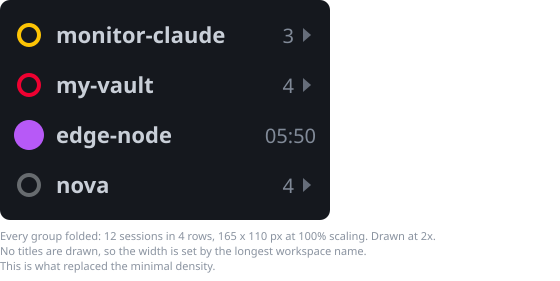
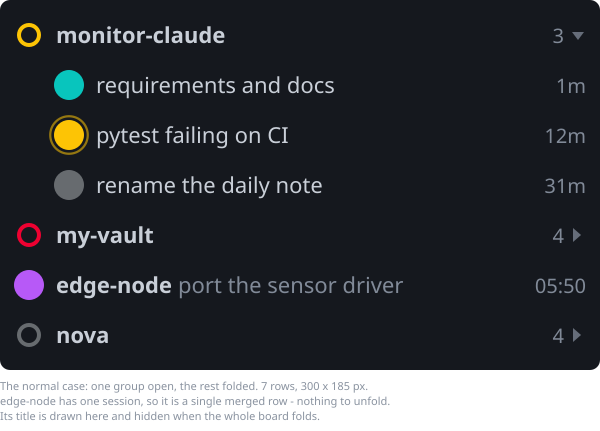
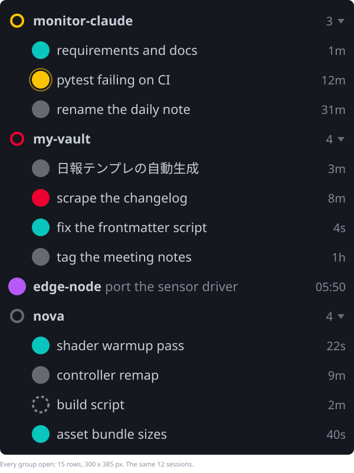
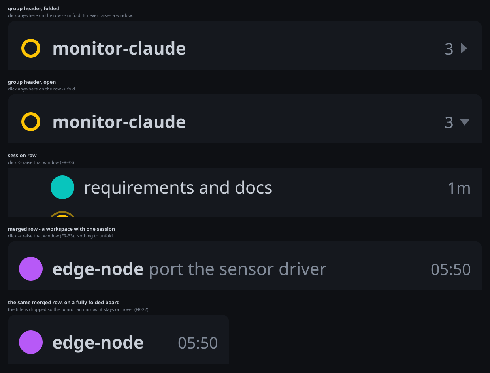
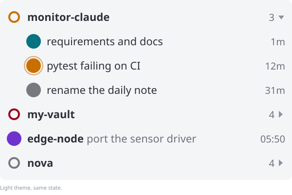
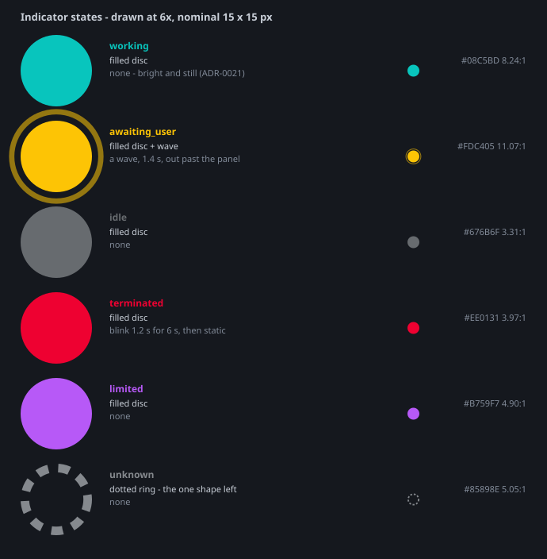
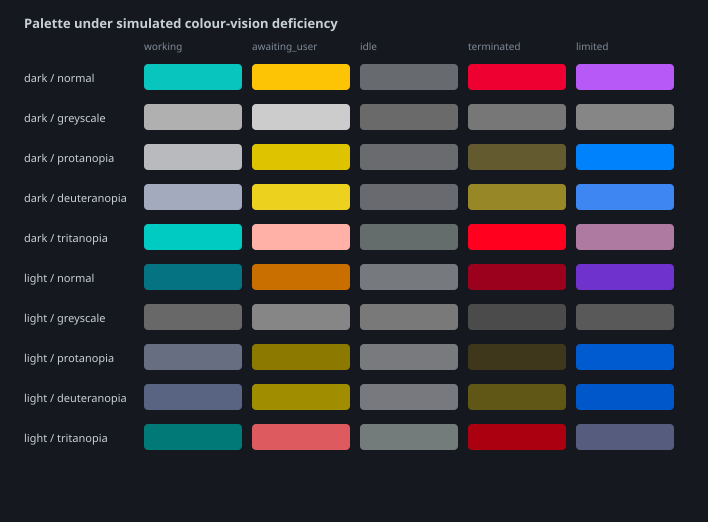

# The overlay board

How the board looks, how it behaves as a window, and what the user can do to it.

The statuses and colours it renders are specified in
[session-state-model.md](session-state-model.md); the requirement IDs come from
[requirements.md](requirements.md).

> Status: **settled**. This document is the visual specification: an implementer should be
> able to build the board from the numbers here and the images in `images/` without asking
> another question. Open decision D-2 is closed by it, and D-3 — whether a click can reach
> the right window — was answered by measurement before the click target was fixed
> ([ADR-0009](adr/0009-map-a-session-to-its-window.md)).
>
> This document describes the **complete** product. Several behaviours below are deferred
> past the first release; which ones is stated in one place only —
> [requirements.md](requirements.md) §11. Nothing here should be read as a claim about what
> v1 contains.

---

## 1. Concept

A single small always-on-top window, positioned wherever the user likes, comparable to the
SteamVR status window: it is not docked to anything, it never demands the foreground, and it
answers one question at a glance — *which session needs me?*

**One density, which folds.** Every session is a row; every workspace is a group; a group
can be folded to a single row and unfolded again. Twelve sessions across four workspaces are
either **4 rows** or **15 rows**, and which one is the user's choice, kept per group and
across restarts.

Folding is what makes the board small enough to leave in a corner. An earlier draft got
there a different way — a second, indicator-only "minimal" density — and that is gone
([ADR-0012](adr/0012-one-density-that-folds.md)). It cost a whole parallel layout, and it
bought a strip of identical 10 px squares that could not say which project any of them
belonged to. A folded group says the project name outright.

---

## 2. Geometry

All dimensions are CSS px at 100 % scaling and scale linearly with the display.

> [ADR-0004](adr/0004-use-tauri-and-rust.md) expected this pass to hand the implementation
> ready-made HTML/CSS. It does not: it hands numbers, SVG specifications, and a palette that
> is checkable as data. The runtime decision is unaffected — the markup is written once, in
> phase 4, from this document — but nobody should go looking for a stylesheet that was never
> produced.

| | Value |
|---|---|
| Width, any group open | **300** |
| Width, everything folded | **set by the longest workspace name** — see §2.5 — clamped to [140, 300] |
| Title line | **28**, always drawn — §2.6 |
| Row height | **25**, every row kind |
| Border | **1**, on all four sides, drawn *inside* the width — §2.6 |
| Vertical padding | 5 top, 5 bottom |
| Horizontal padding | **7** |
| Indicator, a session | **15** across, round |
| Indicator, an open workspace | **12** across, hollow, 2 px stroke — smaller *and* an outline (§3.1) |
| Session-row indent | **20** — the child indicator starts just past where the parent's ends |
| Gap, indicator to text | **6** |
| Gap, workspace name to title (merged row) | 7 |
| Gap, text to the right-hand column | 8 |
| Right-hand column | **content-width**, right-aligned: a count on a group header, a time on a session or merged row |
| Chevron column | **7**, at the right edge, 4 px clear of the column beside it |

A 25 px row is a 15 px mark with the 5 px of margin the 10 px mark used to have in a 20 px
row: the row is sized for the mark, because the mark is what the board is read by. The mark
itself went 10 → 20 → 15 in one day — 10 was a speck at 175 % scaling, 20 crowded the type,
and 15 is where it landed after being looked at rather than reasoned about.

The horizontal figures are deliberately tight. On a folded board the workspace name is the
only thing carrying meaning, and an earlier draft spent **91 px of padding, gaps and
reserved columns around an 84 px name** — more chrome than content. The reserved 34 px time
column was the worst of it: it was sized for the widest thing the column could ever hold
rather than for what is in it, so a board showing four one-character counts still paid for
`05:50`.

Measured from the specification, for 12 sessions across 4 workspaces:

| State | Rows | Size | Area |
|---|---|---|---|
| Every group folded | **4** | **170 × 140** | **19 %** |
| One group open, the rest folded — the normal case | 7 | 300 × 215 | 52 % |
| Every group open | 15 | 300 × 415 | 100 % |

Each height is the title line (28) plus the rows plus the padding plus the two border edges.
The folded width is 170 rather than 160 because the title line is content too — see §2.5.
**These are the panel**; the window around it is 16 px larger on every side (§2.7).

(160 px is what the longest name in that example — `monitor-claude`, 84 px — works out to
once the chrome around it is 76. The number is content, not a constant.)

**The indicator was 10 × 10 until 2026-08-27**, and the two shapes §3.1 still draws — the
wave's ring and `unknown`'s dotted one — come from figures measured on that cell. They are
scaled by the ratio rather than re-tuned. The reason for the change is
plain: at 10 px on a 175 % display the mark is a speck, and the board's whole job is to be
readable from across the desk at a glance.

### 2.1 Folded

A folded group is one row: roll-up indicator, workspace folder name (last path segment,
never the full path — FR-04), the live session count, and the chevron. The roll-up
indicator uses the precedence in the state model, so a folded group still says *something
in here needs you* without being unfolded — which is the whole reason folding is safe.

**No session title is drawn anywhere on a fully folded board**, which is what lets it
narrow: with the title column gone, the widest thing left is a workspace name. See §2.5.

### 2.2 Open, and the normal case

Unfolding inserts that group's session rows beneath its header. Nothing else moves except
downwards; no group reorders, ever (FR-23).

### 2.3 A workspace with one session is one row

`edge-node` above has a single session, so it is **not** drawn as a header plus a row. A
header that says "1" above a row that says everything is pure duplication, and it doubles
the height of the commonest kind of group.

It is drawn as a **merged row** instead: indicator, workspace name, session title, time. It
has no fold state **of its own**, because nothing is hidden behind it — and therefore no
chevron. A click on it does what a click on a session row does: raises the window.

It does follow the **board's** state, though: **when everything is folded the merged row
drops its title** and keeps only the name and the time. Otherwise one long title would hold
the whole board wide while nothing else needed the width. The full title stays one hover
away (FR-22), and the time stays because for `limited` the reset clock is the actionable
half (§7).

### 2.4 The three row kinds

| Row | Carries | A click |
|---|---|---|
| **Group header** | roll-up indicator · folder name · count · chevron | folds / unfolds. **Never** raises a window |
| **Merged row** (one-session workspace) | indicator · folder name · title · time — **no title while the board is folded** | raises that window (FR-33) |
| **Session row** (indented) | indicator · title · time | raises that window (FR-33) |

That split is what keeps folding and FR-33 out of each other's way: **headers fold, rows
raise.** A row that did both would have to guess which the user meant.

| Element | Rule |
|---|---|
| Indicator | Colour, per §3 — plus motion on the two statuses that summon. Fixed width so the titles line up. |
| Folder name | Semibold, primary colour. |
| Title | Shown as-is, truncated to fit per §4. Never wraps. Never reflows on status change. On a merged row it is the secondary colour, so the folder name still reads as the group. |
| Time | Time in the *current status*, not session age; coarse (`12s` → `4m` → `2h`). Right-aligned so the column stays a rhythm, not noise. For `limited` this column shows the **reset clock time** instead (`05:50`), which is the more actionable of the two numbers. |

**The git branch is not shown.** The data is available and the width very nearly is, but the
title column is the only thing carrying identity, and a branch name would compete with it
for that width while frequently being identical across the sessions it is meant to
distinguish. It is in the hover tooltip instead.

### 2.5 What folds, when

- **Fold state is per group, remembered, and restored** (FR-28). The board does not decide
  for the user twice.
- **A one-session workspace has no fold state at all** — §2.3.
- **A height cap folds automatically.** Past a configured row count (default 12) the board
  folds groups, least urgent first by the roll-up precedence, until it fits. This is the only
  time the board folds something the user opened, and it never folds a group containing an
  `awaiting_user` session.
- **Unfolding never reorders.** Group order is first-seen and persisted, not alphabetical and
  not by urgency (FR-23), so a group sits where the user last saw it.

**Width follows the fold, in two steps and no more.**

- **Any group open → 300.** Session rows carry titles, and titles need the width.
- **Everything folded → the longest workspace name**, plus the indicator, the count and the
  chevron — or the title line, whichever is wider — clamped to **[140, 300]**.

  The title is measured with the names because it is text that is always there: a board that
  narrowed past its own title would cut the one label it always draws. On this machine's font
  the title measures 170 px, which is the floor in practice.

Two discrete widths rather than a continuous fit, deliberately: a board that re-measured
itself every time a title changed would twitch in the corner of the eye all day, and titles
change mid-session (FR-23). The folded width is recomputed only when the **set of
workspaces** changes, never on a status or title change.
([ADR-0015](adr/0015-the-folded-board-narrows-to-its-names.md).)

### 2.6 The edge and the title line

Two additions from using the board rather than looking at it.

**The board was dissolving into the editor behind it.** A borderless window at `#15181E` on
VS Code's `#1F1F1F` is a slightly darker rectangle with no edge — on a second display, in the
corner of the eye, there is nothing for the eye to catch.

**The fill cannot fix that, and this is the constraint that decided the design.** `idle` sits
at 3.31:1 against the board, which is the 3:1 floor plus rounding — deliberately, because
`idle` is meant to be the faintest thing drawn
([ADR-0013](adr/0013-make-idle-the-faintest-thing-on-the-board.md), asserted by TC-48).
Lightening the panel to separate it from the editor would drop the faintest status through the
contrast floor and break FR-16. So the separation is entirely in the **edge**:

| | Dark | Light |
|---|---|---|
| Border, 1 px | `#55606F` | `#98A1AD` — darker than the dark theme's edge is light, because a light panel on a white editor has nothing but its border doing the separating |
| Top edge | the border, plus white at 34 % — a panel lit from above reads as raised | the same overlay, which lands on a light border and does nothing, correctly: a panel darker than its background needs no highlight |
| Title line fill | `#2E3648` | `#DDE0E6` |
| Rule under the title | `#3B4557` | `#C4CAD3` |
| Shadow | none: the window casts none and the panel draws none ([ADR-0034](adr/0034-the-board-casts-no-shadow.md)) | the same — and it is the light theme that made the case, because a drop shadow over a white editor is the most visible thing about the board |

**None of it is a status colour.** Teal, amber, violet, crimson and the two greys each mean
something on this board, and an earlier draft ran a teal rail down the left edge: it put a
`working`-coloured mark on a board where nothing might be working, and spent the loudest
identity cue in the product on decoration.

**The title line — `☰ Monitor your agents`, 28 px — is an affordance, not a heading.** FR-27
makes the whole body the drag handle, and nothing on screen said so: an undecorated window
offers the user nothing to aim at. A strip that looks like a title bar is the cheapest way to
say *grab here*. It costs one row of height, always; showing it on hover was rejected, because
an affordance that appears once you already know where to point is not an affordance. The ☰ is
where the context menu of §6 lives.

**What this does not fix.** Losing the board across several displays is a *finding* problem,
and no border answers "which screen is it on". The tray icon (§5) and the bring-it-to-me key
(§6.3) are the answers to that.

### 2.7 The window is larger than the board

The window is **16 px bigger than the panel on every side, and that space is transparent**
([ADR-0022](adr/0022-the-window-is-larger-than-the-board.md)). One thing is drawn in it:

- **The wave off an `awaiting_user` indicator**, which expands to about three times the disc
  and crosses the panel's edge. The one status that means *the developer has to move* is the
  one thing on this board allowed to leave it.

The shadow used to be the margin's other tenant and is gone
([ADR-0034](adr/0034-the-board-casts-no-shadow.md)). The margin stays as it is: the wave is
what sets its size, and it always was.

Three consequences, and none of them is free:

- **The window's hit area is the whole window**, transparent margin included, so a 16 px band
  around the board takes clicks that would otherwise reach the editor underneath. Judged
  acceptable — it is 16 px, and the alternative is a per-pixel hit test that has to
  distinguish the panel from the wave passing over it.
- **The remembered position is the window's**, so the panel appears 16 px in from where the
  numbers say. Nothing the user can see is wrong; the numbers are simply about the window.
- **`width()` and `height()` are the window; `panel_width()` and `panel_height()` are the
  board.** The [140, 300] clamp of §2.5 is a statement about the panel, and the margin is
  added outside it.

The panel's corners are rounded (4 px), which a transparent window makes possible — and the
panel does **not** clip its own overflow, because the wave is overflow and clipping it at the
panel edge is precisely the thing this section exists to avoid. The title strip rounds its own
top corners instead.

### 2.8 The size the user chose

Every number in §2 is the design's own, and the design was drawn on one developer's display.
The board can be drawn at **100, 125, 150 or 200 %** of them, chosen from the menu (§6.2) and
remembered (FR-28).

**Steps rather than a slider**, and the reason is arithmetic: every dimension here is a whole
number of CSS pixels, and a board at 137 % rounds each of them separately — a one-pixel error
in the row height is fifteen down a full board. Four steps also means the folded width is
measured four times at most rather than on every drag of a slider. They are the same
percentages Windows uses for display scaling, deliberately: a user who has met 125 % once
should not have to learn a second scale for one window.

**Scaled once, at the end.** The window size is the panel's own figures plus its margins,
multiplied by the percentage — not each figure scaled and then added, which rounds four times
and puts the error in the total. Inside the window the front end applies the same multiplier
to everything at once, so the ratios are exactly what §2 says whatever size the board is at.

**That one rounding goes to the nearest pixel, not downwards.** A window is a whole number of
pixels and the picture inside it is not: a 147 px board at 125 % is 183.75, and taking 183
leaves the window a fraction shorter than what it contains, which clips the last row. Half a
pixel of margin is invisible; half a pixel of missing row is not. So the four sizes are 100 %
332 × 147, 125 % 415 × 184, 150 % 498 × 221 and 200 % 664 × 294 for a board of three rows.

**This is not the display's scaling.** The board already follows that (FR-29): CSS pixels
scale with the display and the window is sized in physical pixels. This is the user saying the
board should be bigger than the design's own size, which is a different question with a
different answer per person and per desk.

### 2.9 Light theme

The light theme is not the dark theme inverted. On paper every indicator has to be dark
enough to clear 3:1 against the page, so the lightness ladder of §3 cannot also carry
urgency there; prominence is carried by chroma and by contrast against the background
instead. Both themes are validated by the same thresholds (§3.3).

---

## 3. The indicator

### 3.1 Channels

**Colour carries the status. The shape carries the hierarchy.**

Until 2026-08-27 each status had a silhouette of its own — filled, hollow, cut, dotted, a
level in a ring — and FR-17 forbade any two sharing one. Six shapes turned out to be six
things to learn on a board that is glanced at rather than studied, and the palette had been
*derived* to carry the status by itself in the first place
([ADR-0010](adr/0010-derive-the-palette-from-a-luminance-ladder.md)): every pair keeps its
stated separation under greyscale and under simulated protanopia, deuteranopia and
tritanopia, and TC-49 … TC-51 measure it on every run. The shapes were insurance on a number
that is already checked, and FR-17 now says so
([ADR-0024](adr/0024-colour-carries-the-status-shape-carries-the-hierarchy.md)).

| Status | Mark | Motion | Reduced-motion substitute | Glyph |
|---|---|---|---|---|
| `working` | filled disc | none — bright and still ([ADR-0021](adr/0021-working-does-not-animate.md)) | — | `▶` |
| `awaiting_user` | filled disc **+ a wave** | the wave expands and fades, ~1.4 s, and leaves the panel (§2.7) | the wave, drawn static just off the disc — it is what makes this the largest mark, so it stays | `?` |
| `idle` | filled disc | none | — | `▪` |
| `terminated` | filled disc | blink ~1.2 s for the first 6 s, then static | none needed — TC-49 holds it 15 dE2000 from `working` in every view | `✕` |
| `limited` | filled disc | none | — | `⏳` |
| `unknown` | **dotted ring** | none | — | `–` |

**Two sizes and two shapes, and none of the four identifies a status.**

A session's mark is **15 across and solid**. An **open** workspace's own mark is **12 across
and hollow** — smaller *and* an outline, because at this size a single cue is easy to miss and
what it has to say is "this is the parent; the rows below are its sessions". A folded
workspace keeps the session's own mark, solid and 15, because there it is the only evidence
there is (FR-18).

- **`unknown` is a dotted ring**, because §3.2 requires it to carry the least ink of the six:
  it is the observer admitting it cannot read a session, and a fallback must not read as an
  alarm. Filled, at 5.05:1, it would be the third loudest mark on the board.
- **An open workspace's own mark is hollow**, and the view model decides that rather than the
  stylesheet: it is a fact about the row, not about the session.

**What was given up.** `limited` lost its draining level, and with it its motion — the level
was the countdown, and the row already shows the reset time as text (§2.4). `terminated` lost
its cut and keeps its blink. Neither is now distinguishable from `working` by shape, only by
colour and by motion, and the honest statement of the cost is in FR-17's amendment: a display
or a pipeline that mangles hue in a way the three simulations do not model now has nothing
standing behind the palette.

**The glyph is not drawn on the board.** The indicator was 10 px when this was decided, so a
glyph inside it would have been about 6 px tall and illegible; claiming it as an
accessibility channel would have been false. The indicator is 15 px now, where a glyph would
be about 9 px — legible, but nothing has measured whether it helps or only adds ink, so the
glyph stays in the tooltip until something does. What the board leans on is the **palette**,
and the numbers in §3.3 are what make that a claim rather than a hope.

**Motion is rationed, and it means one thing: the developer has to move.** Only
`awaiting_user` and `terminated` animate, and nothing else on the board moves at all.

**An open group's header does not send the wave**, though it still shows the disc. The
roll-up exists so that a *folded* group can say "something in here needs you" without being
unfolded (FR-18); while the group is open, the session it speaks for is drawn one row below,
and two waves a row apart are two calls to action for one event. `working` used to pulse — the commonest status on the board,
moving perpetually in the corner of the user's eye, which is exactly the board that teaches a
user to ignore it ([ADR-0021](adr/0021-working-does-not-animate.md)). It is now still.

**Nothing fades with age.** An earlier draft dimmed an idle indicator to 55 % opacity after
30 minutes (`T_dim`), so that old results did not compete with fresh ones. That rule is gone
([ADR-0013](adr/0013-make-idle-the-faintest-thing-on-the-board.md)), for two reasons that
arrived together. **Every row now shows its own age as text** — there is no longer a density
without a time column, which is what `T_dim` was compensating for. And a recessive `idle` has
no room for it: at `#676B6F` the indicator sits at 3.31:1, and **any opacity below 92 % puts
it under the 3:1 floor** — measured the way the board composites, which is the browser's, in
sRGB channel values ([ADR-0017](adr/0017-judge-opacity-by-srgb-compositing.md); ADR-0013
quotes 87 %, which is the same measurement taken in linear light). Age is a number in the
time column, not a brightness.

### 3.2 Palette

The colours are **derived, not picked**. Each one is generated from a target CIE L\* and a
target Lab hue angle, taking the most chroma that stays inside sRGB, and the whole set is
then checked against thresholds set by consequence. The reasoning, and what the previous
by-eye palette measured, are in
[ADR-0010](adr/0010-derive-the-palette-from-a-luminance-ladder.md).

**Dark theme** — board `#15181E`, hairline `#2A2F38`, text `#C9CFD8`, secondary `#818A98`,
edge `#55606F`, title line `#2E3648` over a `#3B4557` rule (§2.6).

The five **displayed** statuses are listed brightest first. `unknown` is listed **last
whatever its lightness**, because it is the internal fallback rather than one of the five —
it is the only row here that the board draws when it has failed to work something out. The
order of this table is not an urgency ranking: only its two ends are, and the paragraph
after it says which.

| Status | Hex | L\* | Contrast vs board |
|---|---|---|---|
| `awaiting_user` | `#FDC405` | 82 | 11.07:1 |
| `working` | `#08C5BD` | 72 | 8.24:1 |
| `limited` | `#B759F7` | 56 | 4.90:1 |
| `terminated` | `#EE0131` | 50 | 3.97:1 |
| **`idle`** | **`#676B6F`** | **45** | **3.31:1** |
| `unknown` | `#85898E` | 57 | 5.05:1 |

**Light theme** — board `#F4F5F7`, hairline `#D4D8DE`, text `#2C3138`, secondary `#6B727C`,
edge `#98A1AD`, title line `#DDE0E6` over a `#C4CAD3` rule (§2.6).
On paper the ladder runs the other way: **lighter means less contrast against the page**, so
the recessive status is the lightest one, not the darkest. Listed the same way — the five in
ladder order, most prominent first, with `unknown` appended.

| Status | Hex | L\* | Contrast vs board |
|---|---|---|---|
| `terminated` | `#9B001C` | 32 | 7.99:1 |
| `limited` | `#7032CC` | 38 | 6.38:1 |
| `working` | `#057381` | 44 | 5.10:1 |
| **`idle`** | **`#767A7E`** | **51** | **3.96:1** |
| `awaiting_user` | `#C96F00` | 56 | 3.34:1 |
| `unknown` | `#565A5E` | 38 | 6.37:1 |

**The ladder pins the two ends and leaves the middle to legibility**
([ADR-0014](adr/0014-the-ladder-pins-the-ends-not-the-middle.md)). Only the ends are an
urgency ranking, and only they must survive a future edit:

- **`awaiting_user` is the loudest thing the board can draw — on the dark theme.** Brightest,
  at least 10 L\* above everything else, and the only one that blinks on its own account.
  Nothing may approach it. **On the light theme it does not lead the ink index and is not
  required to**: every indicator there has to be dark to clear 3:1, and amber cannot go dark
  without turning brown and colliding with `terminated`. What holds on both themes is that
  `awaiting_user` is the **largest mark the board draws** — 160 px² against `working`'s 100 —
  because it is the only status with a halo
  ([ADR-0018](adr/0018-the-loud-end-is-a-dark-theme-property.md)).
- **`idle` is the faintest**, on both themes. The resting state does not compete. On the dark
  theme it sits at the contrast floor — 3.31:1 against a 3:1 requirement — with nowhere
  further to go.
- **In between, prominence is not an urgency ranking, and does not pretend to be.**
  `terminated` is dark because its hue has to stay clear of amber under colour-vision
  deficiency, so *its* prominence comes from the blink. `working` is bright because *how much
  is alive right now* is information this board exists to carry, not a summons — it is bright,
  it never blinks. `unknown` carries the least ink of all six despite a mid luminance,
  because a fallback must not read as an alarm.

**Prominence is contrast × area, not contrast alone.** Relative ink index — indicator area ×
contrast — on the nominal 10 px cell the silhouettes were designed on, dark theme. Drawing at
15 px multiplies every figure by 2.25 and changes no ordering, which is the only thing this
table is read for:

| `awaiting_user` | `working` | `limited` | `terminated` | `idle` | `unknown` |
|---|---|---|---|---|---|
| **1521** | 647 | 385 | 311 | **260** | 92 |

These moved twice in one day: once when the marks became circles, and again when five of the
six became the *same* circle. What survived both is what
[ADR-0014](adr/0014-the-ladder-pins-the-ends-not-the-middle.md) pins — `awaiting_user` is the
loudest, `idle` the faintest of the five, `unknown` the faintest of all six. The middle is now
ordered purely by contrast, since five marks share an area, and ADR-0014 was always explicit
that the middle is not an urgency ranking.

`idle` is the faintest of the five on colour alone now that they share a shape — which is
what ADR-0013 asked for in the first place, and the reason its hex sits on the contrast floor
rather than above it.

**The one sentence underneath all of it:** the alarm channel is **amber and crimson plus
motion**, and everything else is ambient. The user scans for two colours; the rest is
context. A folded group in teal means *this workspace is busy*; a folded group in faint grey
means *something here finished and nothing is being asked of you*.

### 3.3 The thresholds the palette has to pass

Two statuses being confusable costs different amounts depending on what the user would then
do wrong, so the requirement is set per pair rather than as one blanket number.

- **Tier A — 15 dE2000, in every view.** Every pair involving `awaiting_user` (the summons),
  plus `terminated` against `working` and against `idle`. Confusing any of these sends the
  user to the wrong place or stops them going at all.
- **Tier B — 8 dE2000.** Every other pair; both members mean "nothing is demanded of you",
  so a confusion costs a glance rather than a wrong move.
- **Greyscale — 15 dE2000 for `awaiting_user` vs `terminated`, 4 for everything else.**
  That pair is the reason the greyscale floor exists, and since FR-17 was amended **every**
  pair has nothing but colour to separate it in greyscale — which is why these numbers are
  now the whole of the guarantee rather than the first half of it.
- **Contrast — at least 3:1 against the board background**, for every indicator including
  `unknown` (FR-17, §8).

Measured worst pair per view, both themes:

| View | Dark | Light |
|---|---|---|
| normal | `idle`/`limited` **23.2** | `working`/`idle` **19.2** |
| protanopia | `idle`/`terminated` **20.5** | `working`/`idle` **8.8** |
| deuteranopia | `working`/`limited` **20.9** | `working`/`idle` **13.2** |
| tritanopia | `idle`/`limited` **23.4** | `idle`/`limited` **18.8** |
| greyscale | `idle`/`terminated` **5.1** | `terminated`/`limited` **4.9** |

These numbers are the acceptance criterion, not an illustration: they are checkable from the
palette constants alone, with no window and no screenshot, and
[test-plan.md](test-plan.md) §7 turns them into a test.

---

## 4. Titles

The title comes from Claude Code and is already a summary, in whatever language the
conversation uses ([observation-sources.md](observation-sources.md) §4). **The board
displays it as-is.**

There is deliberately no shortening logic (FR-19). Summarising a title well — dropping the
filler, keeping the distinguishing part — is a language-dependent judgement, and doing it
without a model produces exactly the kind of confident nonsense this product avoids
elsewhere ([ADR-0005](adr/0005-no-goal-achievement-status.md) is the same reasoning applied
to statuses). Claude Code already did the summarising.

All that remains is fitting, and fitting is mechanical:

1. **Normalise** whitespace and strip control characters.
2. **Truncate to the available width** — measured in *rendered width*, not characters,
   because a CJK glyph is twice as wide as a Latin one (FR-20). Cut on grapheme-cluster
   boundaries only, and mark the cut with `…` (FR-21).

Rules that must hold:

- The full title is always reachable on hover (FR-22).
- A title that changes mid-session updates in place; it is not a new session (FR-23).
- Nothing here calls a model, and nothing leaves the machine (FR-19, NFR-08).
- **Hide-titles mode** (FR-35) replaces every title with a neutral placeholder for screen
  sharing, without changing the layout — so the board does not jump when it is toggled.

The font stack is `ui-sans-serif, "Segoe UI Variable Text", "Segoe UI", "Yu Gothic UI",
"Meiryo", system-ui, sans-serif` — CJK has to render at 11 px without falling back to a
substituted face, because a title in Japanese is the normal case, not the exception.

---

## 5. Window behaviour

| Behaviour | Specification |
|---|---|
| Always on top | Above maximised editors and full-screen-borderless windows. Never above system-modal dialogs (FR-26). |
| Frameless | No title bar; the body is the drag handle (FR-27). |
| Never steals focus | It appears, updates, and blinks without taking keyboard focus (FR-30). |
| Free placement | Any position on any display, including across DPI boundaries (FR-29). |
| Edge snapping | Snaps to screen edges and to other corners within 12 px; hold `Alt` to place freely. |
| Growth across scale factors | A board measured on a 100 % display is 75 % narrower than the same board on a 175 % one, and both numbers are physical pixels. Two things follow. A summons works its corner out from the size the board will have **on the display it is going to**, not the one it has now, or it arrives through the far edge. And a resize that pushes a board off the display it was wholly on brings it back by exactly its overhang (TC-119) — a board its owner parked over an edge is left there, because a resize did not put it there. |
| Growth direction | The board resizes **away from the edge it is snapped to**: snapped left or unsnapped, it grows right and down from its top-left; snapped right, it grows left; snapped to the bottom, it grows up. A board parked in a corner must not walk off the screen when a group is unfolded. |
| Persistence | Position, display, per-group fold state, opacity and settings survive a restart. If the remembered display is gone, the board returns to the nearest visible position (FR-28). |
| Never lost | The same check runs **while the board is running**, every few seconds. A display can be unplugged or put to sleep with the board on it, and a frameless window with no taskbar button is then unreachable. *Reachable* is the test, not *fully on screen*: a board straddling two displays, or parked half over an edge to keep it out of the way, is where its owner put it and is left alone. |
| Minimum size | **140 × 30** when empty — one row's worth at the narrowest width. Folded with groups present it is whatever the longest workspace name needs (§2.5). |
| Opacity | Adjustable; a lower opacity while idle and full opacity when any session needs attention is the intended default behaviour. |
| Click-through | Optional mode where the board ignores the mouse entirely (FR-31); it must be visibly indicated and easy to leave. |
| Tray | A left-click on the tray icon **brings the board to the display the pointer is on**, or takes it away when it is already in front of the user; a right-click carries the board's own menu (FR-32). The menu says where the board is, and offers to fetch it. That line is replaced when it stops being true rather than when the menu opens — the shell opens a tray menu without asking the application — so a board dragged to another display is named correctly within the same few seconds the rescue runs in, not instantly. It is drawn in the board's roll-up colour — see below. |
| Start on login | Opt-in, off by default (FR-32). **Not built**: it writes to the user's `Run` key, which needs the consent flow of [hook-setup.md](hook-setup.md) §4 rather than a checkbox. |

**The tray icon is the board in miniature**, not a coloured dot: the panel's own fill, the
panel's own edge, and the roll-up mark in the middle. The reason is §3.3 — every separation
the palette rests on is measured against the board's background and nowhere else, and a disc
on a transparent icon would sit on a taskbar whose colour nobody has measured anything
against. Drawing the tile puts the measured pair on screen instead
([ADR-0025](adr/0025-the-tray-icon-is-the-board-in-miniature.md)). Two things follow: the
edge is also what separates the icon from a taskbar tinted close to the board, and `unknown`
is drawn as a plain ring rather than §3.1's dotted one, because at 16 px the dots resolve to
a smudge that reads as a filled disc — a definite status, where the meaning is that there is
not one.

The icon carries no motion. `awaiting_user` waves and `terminated` blinks on the board; in
the tray both are colour alone, which is the same reduction §3.1 already requires to lose no
information under reduced motion.

---

## 6. Interaction

| Action | Result |
|---|---|
| Click a **group header** | Fold / unfold that group. It never raises a window. |
| Click a **session row** or a **merged row** | Raise the VS Code window that owns it (FR-33). See §6.1. |
| Hover any row | After 400 ms, the tooltip: full title, workspace path, git branch, status, time in status, and how the status was established (observed directly, inferred, or reported by a hook). |
| Double-click the background | Fold all / unfold all. |
| Drag the background | Move the board. |
| Right-click | The board's menu — §6.2. |
| Click a `terminated` entry whose session is gone | Dismiss it (FR-59). |
| `Ctrl+Alt+M` | Bring the board to the display the mouse is on — §6.3. |
| `Ctrl+Alt+B` | Show or hide the board. |
| Left-click the **tray icon** | Show or hide the board — the way back when the key above has been forgotten (§5). |
| Right-click the **tray icon** | The same menu as the board's own — §6.2. |

Optional, off by default (FR-34): a sound or flash when a session enters `awaiting_user` or
`terminated`. Nothing else may ever produce a notification.

### 6.1 The click target, and telling the user whether it worked

**The whole row is the hit area** — 300 × 25 px, 7500 px² for a 15 px indicator. Nothing has
to be aimed at. This is a straight gain from dropping the indicator-only density, where the
same click had to land inside a 16 × 22 px slice.

**Click versus drag** is settled by movement, not by where the press landed: a press that
moves more than **4 px** before release is a drag; anything else is a click on whatever row
the press started over. So a deliberate drag still moves the board, and an ordinary click
still acts on the row, and neither has to be aimed.

**The raise is verified.** Measurement ([ADR-0009](adr/0009-map-a-session-to-its-window.md))
established two things that shape this. First, a board that never takes focus cannot use the
naive Win32 call — it is refused outright, 0 attempts out of 3, and refusal looks exactly
like success from the return value. Second, reading the foreground window back afterwards
*does* distinguish them. So:

| Outcome | What the board does |
|---|---|
| The target became the foreground window within 250 ms | A 150 ms ring flash on the clicked row's indicator. That is the entire acknowledgement — brief, local, and gone. |
| …and *Open the session's tab too* is on | A URL naming the session is sent to the editor, which reveals that session's tab and focuses its message box. Only while that window is still the foreground one, and only where the session belongs to its workspace — the editor's own documented precondition, and without it a mis-aimed URL opens a *duplicate* rather than doing nothing ([ADR-0029](adr/0029-reveal-the-session-through-the-editors-url-handler.md)). The tab follows the window by however long the editor's launcher takes to start, which is the editor's cost and not the board's. Off by default |
| It did not | The indicator draws a hollow outline for 2 s, and the row's tooltip says the window could not be raised. **Never silent.** |

Two limits are part of the behaviour, not bugs in it: the raise cannot select *which session
inside the window* is shown, and where two windows have the same folder open either may come
up (limitation L-1). The board still has to carry the information itself — the jump is a
shortcut, not the way it is read.

---

### 6.2 The menu

**Native, not drawn.** Everything else about this board is custom — the chrome, the marks, the
wave — but a menu is not a place to be original: it wants the platform's keyboard handling, its
edge flipping and its screen-reader support, and it is the same menu the tray icon carries
(§5, FR-32). Two implementations of one menu is one too many.

It is built fresh on every right-click, because two of its items are statements about the
board's current state and a menu built once is a menu that is wrong the second time it opens.

| Item | |
|---|---|
| *Waiting for you is exact* / *worked out from a pause* | **Disabled**: a statement, not an action. This is FR-55's home — the mode has been living in a tooltip and in the setup window since there was no menu to put it in |
| **Size ▸** 100 % / 125 % / 150 % / 200 % | §2.8. The current one is ticked |
| *Bring the board to me* `Ctrl+Alt+M` | Disabled, and shows the key rather than invoking it. **Says, for that key alone, when it belongs to something else** — or *not set* where the user cleared it |
| *Show or hide* `Ctrl+Alt+B` | The same |
| *Change these keys…* | Opens the screen that rebinds or clears them (FR-61). Directly beneath the two lines it repairs |
| *Focus the session tab on click…* / **✓** *Focus the session tab on click* | Off, an ellipsis: it explains before anything happens ([ADR-0029](adr/0029-reveal-the-session-through-the-editors-url-handler.md)). On, a tick that switches off in one click — undoing something already agreed to needs no second screen. The label names **when** it happens, because the item sits in a menu opened by a right-click and describes what a *left*-click will do |
| *Check the reporting…* | Opens the diagnosis ([hook-setup.md](hook-setup.md) §5) — the other half of FR-55. Shown whatever the mode: "why is it exact" is as fair a question as "why is it not", and an item that appeared only once something was broken would be one nobody had ever seen by the time they needed it |
| *Notice waiting instantly…* / **✓** *Notice waiting instantly…* | Opens the hook setup ([hook-setup.md](hook-setup.md) §4). Named for what the user gets, not for the mechanism. **Ticked when the mode is exact**, and the ellipsis stays either way: the click opens the removal screen rather than switching anything off, because taking the entries out rewrites the user's own `settings.json` and FR-54 does not allow that without a decision. The tick is here because the mode line three items above is a sentence, and a sentence is not what a reader scans for — measured the hard way, by this menu's own author installing the hooks and going looking for a tick that was not there |
| *Quit* | |

**Two meanings for the tick, and the ellipsis tells them apart.** On *Size* and on *Focus the
session tab on click* a tick means "on, and one click switches it off". On *Notice waiting
instantly* it means "on" alone: the click opens a screen, because switching this one off edits
a file the product does not own. Every item in this product that explains before it acts ends
in an ellipsis, and that is the mark to read — a ticked item with an ellipsis is on, and will
still ask before it changes anything.

**The board takes focus while the menu is open**, and only then. FR-30 keeps it out of the
user's way while it *updates*; a right-click is the user talking to it. Without the focus the
menu appears and then ignores every click, because a popup menu tracks input for the window
that owns it and this window is never the active one — which is exactly what the first version
did.

Still to come, and listed here so the gap is visible: fold all / unfold all, opacity,
click-through, hide titles, and the notification toggle of FR-34.

### 6.3 The two keys

Both answer the same problem from opposite ends: a small always-on-top window on a desk with
several displays is easy to lose and occasionally in the way.

**Bring the board to me** moves it to the display the pointer is on, to the top-right of that
display's work area, shows it, and **flashes its edge once**. The corner is the same one the
tray icon and a second launch use — one rule, so that *where will it appear?* is a thing that
can be learned once ([ADR-0031](adr/0031-one-corner-for-every-summons.md)). The flash is half the feature: after a
keypress the user is looking somewhere else on a large screen, and a window that has silently
arrived is a window they still have to find. No amount of border answers *which screen is it
on?* — that is a question about finding a window, and only the window can answer it.

**Show or hide** takes the board away and brings it back where it was.

**Where is it?** The tray's copy of the menu states which of three the board is in: *hidden*,
*off every display*, or *on display N*. Nothing separates them from the outside — in all three
the user is looking at a screen with no board on it — and the repairs are different, so the
one that is happening has to be said rather than guessed at. If the line names the display
being looked at and there is still nothing there, the window is where it should be and what
failed is the drawing.

**Neither takes focus** (FR-30). The board is summoned, looked at, and left alone.

**A key that is not registered says so, and only that key.** Another application may already
hold it, and a shortcut that silently does nothing is a feature the user cannot tell from a
broken one — the same argument FR-52 makes about hook mode, in a different corner of the
product. The menu carries one line per key and five possible tails: the key alone when it is
working, *another application has it*, *the board's other shortcut has it* when both rows were
set to the same combination, *not a key this can use*, and — for a key the user cleared —
*not set*, which states no problem because there is none.

**And a key that is not free can be changed** (FR-61). *Change these keys…* in the menu opens
one screen: click a key, press the combination, and what the operating system answered appears
under it. At least one modifier is required, because a global shortcut of a bare letter is
that letter taken from every other program on the machine. Clearing a key is a supported
answer, not a failed one — someone whose keyboard is already spoken for is better served by a
board with no shortcut than by one that fights for a key
([ADR-0033](adr/0033-a-key-that-is-taken-is-a-choice-to-undo.md)).

## 7. The usage-limit countdown

When a session is turned away by the usage limit, the indicator's interior level drains:
full at the moment of rejection, empty at the reset. Four things about it are settled by
measurement rather than by taste.

- **The scale is per incident, never five hours.** The five-hour window is *rolling*: the
  reset is when the oldest usage ages out, not five hours after the rejection. Measured
  waits were 5.4 min, 5.7 min, 41.5 min, 3 h 00, 3 h 01 and 3 h 35, so a bar drawn against a
  five-hour maximum would start somewhere between 2 % and 72 % full and never once fill.
  The full length is `resetsAt − rejection`, and both ends are in the record, so it is
  recoverable even by a board that started after the rejection happened.
- **The start is pinned to the first rejection carrying the current `resetsAt`.** Two
  rejections 19 seconds apart returned the same reset time; keying the bar to the latest one
  would make it jump backwards every time the user retried into the wall.
- **An empty level does not mean "ready".** `resetsAt` is exact, but nothing proves the
  session is usable at that instant — in the two short cases the user resumed 6 and 7 minutes
  after it. When the level empties, the indicator becomes a hollow violet outline and the
  tooltip reads *reset time passed, waiting for activity*. The status itself clears on
  observed activity, never on the clock (state model §6).
- **It never fades out from under the user.** With opacity aging gone (§3.1) there is no
  longer a rule that could take a three-hour countdown dark half way through — a question the
  earlier draft had to answer with an explicit exemption, and now does not.
- **Ten-minute granularity in text.** Every observed reset landed on a whole ten-minute
  mark, so a seconds display would be inventing precision. The level may drain continuously;
  the text does not tick. Under reduced motion the level steps every ten minutes instead,
  which is the data's real resolution rather than an absence of animation.

The time column shows the reset clock time (`05:50`) next to the draining indicator rather
than replacing it: for a three-hour wait, *when* is more actionable than *how much longer*,
and both fit. The countdown lives **inside the indicator**, not in a bar of its own, so it
costs no width and it survives being folded away — a folded group whose roll-up is `limited`
drains exactly the same.

---

## 8. Accessibility

- Status rests on the palette, and the palette is measured: every pair keeps §3.3's
  separation under greyscale and under simulated protanopia, deuteranopia and tritanopia
  (FR-17, TC-49 … TC-51). Until 2026-08-27 a silhouette stood behind each status as well;
  ADR-0024 records what taking it away bought and what it cost.
- The board must remain readable at 100 %, 125 %, 150 % and 200 % scaling. Every dimension
  in §2 scales linearly; nothing is a fixed pixel constant in the implementation.
- Contrast of every indicator against the board background is at least 3:1 (measured, §3.2);
  text meets 4.5:1.
- Every interaction reachable by mouse is reachable from the tray menu — which is the board's
  own menu, so the two cannot fall out of step (§5). The board's own targets are full
  300 × 25 px rows, comfortably above any pointing-accuracy floor.
- The tray icon states its status in words as well as in colour: hovering it names the
  loudest thing on the board, so the one surface with no room for a label has one anyway.
- The UI's own strings are externalised, with Japanese and English both supported, and the
  font stack renders CJK correctly at small sizes (FR-25).
- Reduced motion loses no information: §3.1 gives every animated status a static substitute
  that is drawn anyway.

---

## 9. Empty and degraded states

| Situation | What the board shows |
|---|---|
| No sessions running | One 30 px row at the minimum 140 px width, holding a 6 px hollow diamond at 40 % opacity. Enough to prove the tool is alive and to give the cursor something to grab; never an empty panel with placeholder rows. |
| Claude Code state directory not found | The same marker in `unknown`'s dotted ring, with a "not detecting anything" tooltip and a link to the troubleshooting section. |
| Formats not understood (FR-39) | Sessions fall back to `unknown`, plus one non-blocking warning in the board and the tray menu. Never a confidently wrong board. |
| Hooks not installed | One discreet, dismissible hint that the *waiting for the user* status is inferred and can be made exact. Shown once, never repeated. |

---

## 10. What this design does not do

Stated so that the next person does not mistake a decision for an oversight.

- **There is no indicator-only density.** The smallest the board goes is one row per
  workspace — 160 × 90 px for the twelve-session example, against the 232 × 22 strip an
  earlier draft proposed. Still about three times the area, and that is the price of every
  entry naming its own workspace ([ADR-0012](adr/0012-one-density-that-folds.md),
  [ADR-0015](adr/0015-the-folded-board-narrows-to-its-names.md)).
- **The board is only as narrow as your longest folder name.** A workspace called
  `Tools_MonitorClaudeForVSCode` sets the folded width for every other row, and the product
  will not abbreviate it — FR-04 says the folder's own name, FR-19 says no shortening.
- **A folded group does not say which of its sessions is the urgent one.** It says that one
  is, by its roll-up colour. Unfolding costs one click.
- **Recency is not encoded by brightness or size.** It is a number in the time column.
  Brightness is spent on urgency, a recessive `idle` has no headroom left to fade into
  (§3.1), and a row that changed size would move every row below it.
- **The raise is folder-accurate, not window-accurate**, where two windows have the same
  folder open (L-1), and it can pick the wrong window where two different folders share a
  last path segment (L-6). Both are recorded in
  [observation-sources.md](observation-sources.md) §7.
- **There is no "finished successfully" colour**, and there will not be one
  ([ADR-0005](adr/0005-no-goal-achievement-status.md)).
